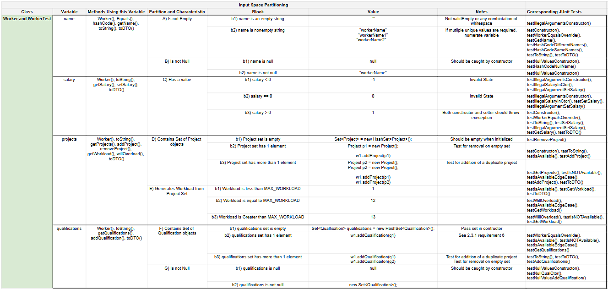
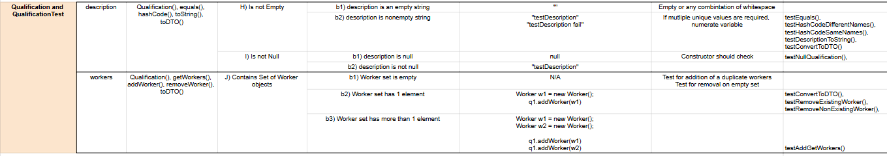
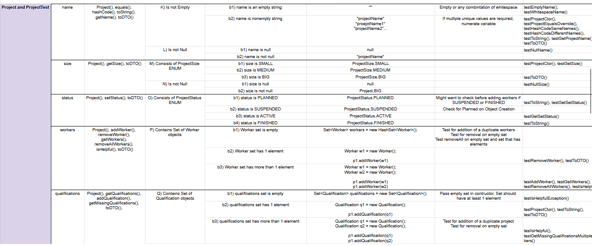
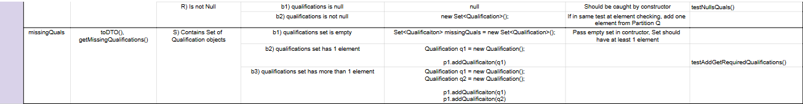

In order to create the input space partitioning table, the team first divided the Project, Qualification, and Worker classes into groups of their class variables. Given these variables, characteristics can be inferred. For example, a class variable that is a string could be an empty string, or a string filled with any combination of characters. It could also be null and not null. From here, specific values can be selected for each block. Generally, at least one test was made for every method. However, some methods can’t be used without each other, and greater functionality requires a sequence of many methods.The input space partitioning table shows a variable, the methods in its class that uses it, the partition with characteristic, block, value, miscellaneous notes about the partition, and the JUnit tests within the class’s test file that uses the input value.
