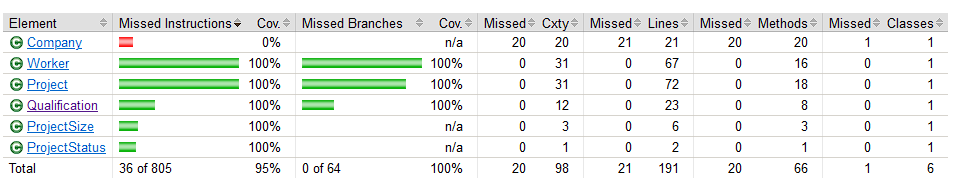

We were able to reach 100% coverage for this first sprint because the logic we implemented in our methods wasn't very intenstive. We will have to implement a more comprehensive testing collection for the next sprint because the branching conditions will be more complex than they were this sprint. We will continue to communicate effectively to educate eachother how to best test the functions we've created.
