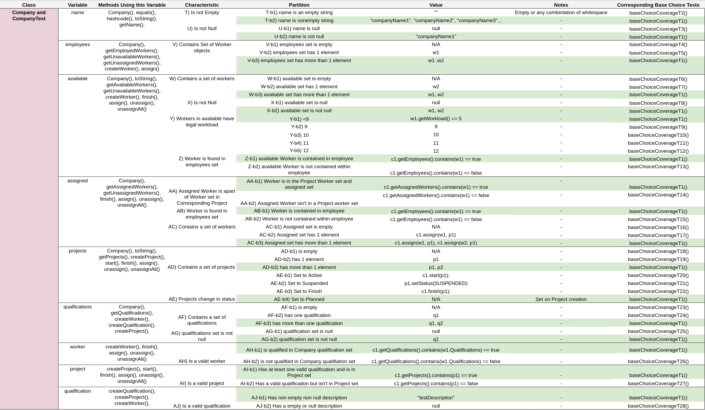

# Sprint 2 ISP Table

## ISP Table

This table provides an overview of the characteristics and partitions for the Company class only.
We used the same strategies as our previous ISP table for sprint 1.
All possible class variables and inputs are listed, then broken down into characteristics and paritions. 
Relevant methods that use these variables are shown next to the variable.
The green rows represent the base choice partition and block for some variable. 
Please note that base choice coverage tests T2-T28 use the same values as T1 except for their labeled white parition and block.

## Base Choice Coverage Table

This table is created from the sprint 2 ISP table. Each test is based on T1 which is composed of all the base choices. 
Each proceeding test then changes only a single partition and block.
It is worth noting that we have removed T14.
This test was supposed to check if the state between a project's worker set and the assigned worker set was consistent.
Since its not clear in the specification where this partition and block are checked or enforced, it has been removed for now.
