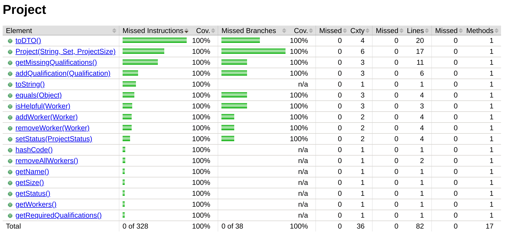

# Sprint 2 Coverage Report
## Total Coverage for Model Package

## Coverage for Company

## Coverage for Worker

## Coverage for Project

## Coverage for Qualification

## In-depth Coverage for Methods in Company

## Coverage Review
After implementing the base choice coverage tests, we would periodically check the Jacoco coverage. 
The team used these missing lines from either the nodes or branches as starting points for writing additional tests. 
Using base choice coverage did a good job of initially providing the vast majority of our coverage. 
We supplemented these tests by adding additional tests that would target the missing branch coverage. 

Overall, the coverage for this sprint is acceptable. 
With the newly added company class, we managed to achieve 100% node coverage but only 98% branch coverage. 
This missing 2% of branch coverage comes from the assign() and unassign() methods.
The team thinks that it is possible to reach 100% in both instruction and branch coverage. 
This missing 2% might come as a result of one or more missing characteristics from our ISP table. 
In total, 2 branches need to be identified and tested.
As of now, it isn’t obvious and some of the logic responsible for these checks should probably be refactored. 
This 2% decline also occurred after fixing some qualification checking logic in the createWorker() method.

When considering all classes in edu.colostate.cs415.model, the node coverage is 100% and the branch coverage is 99%. 
While we didn’t have enough time to discover these final two branch conditions that would maximize our coverage, this coverage is still good and should increase next sprint.
