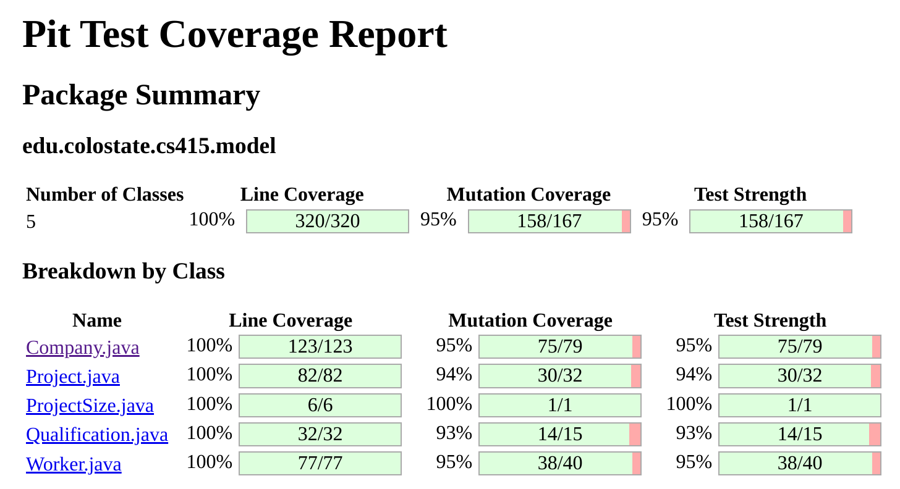

# Sprint 2 Mutation Report

## The lastest PIT mutation report has generated the following values:

## Mutation Testing Review

Mutation testing was able to help identify weak points in our test suites.
After running PIT, we would look at the specific lines that had surviving mutations and then create tests to try and target these values.
We specifically added tests createWorkerInvalidSalary() and testUnassignAddToAvailable() to handle two mutants that were identified in Company after completing all base choice coverage tests.
The use of base choice coverage alone provided strong tests.
Even before writing extra tests, mutation coverage and test strength scores were already over 90%.

The results from the PIT mutation tests illustrate that our current set of tests are generally effective.
The mutation coverage and test strength are high for the entire package. 
When breaking down each class, there is no class that has under 93% in either mutation coverage or test strength.
There is room for improvement in Company, Qualification, Worker, and Project.
There wasn't enough time left after fixing errors identified from reviewing the sprint specifications to get higher numbers, but it seems possible to reach 100% in mutation coverage and test strength for all classes in the model package.
