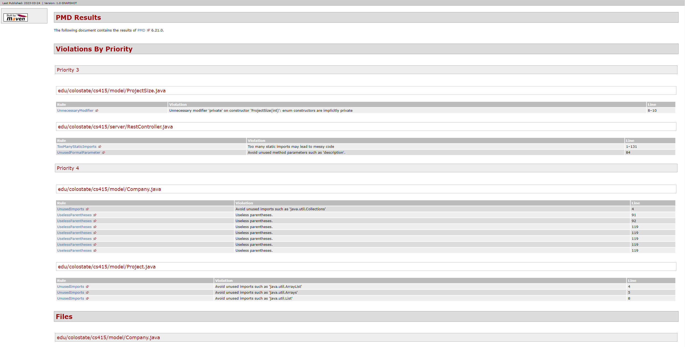
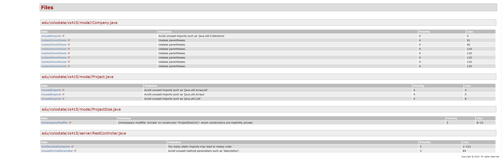
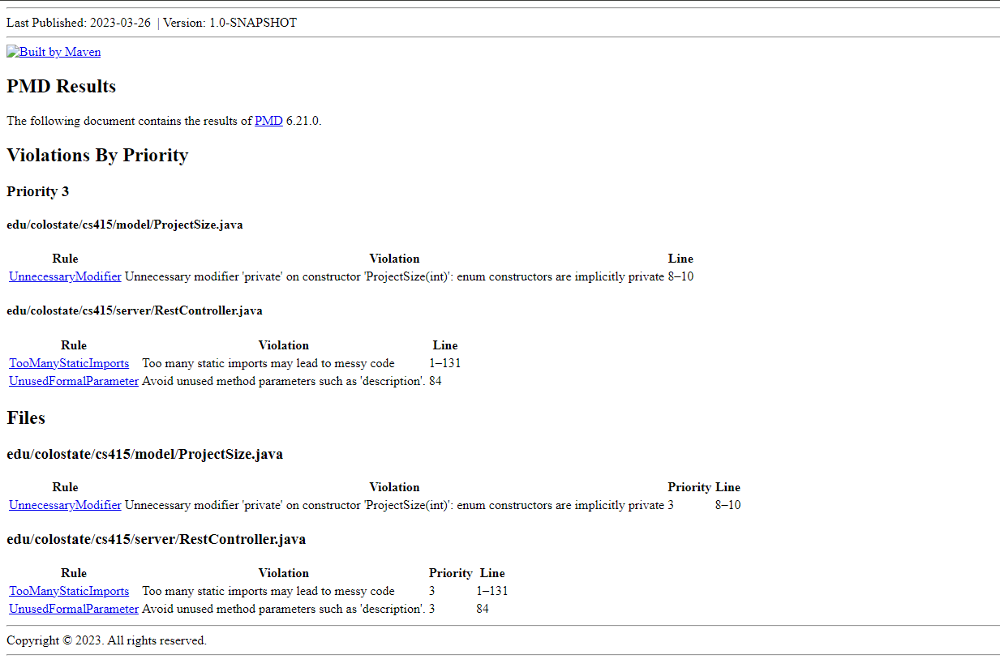
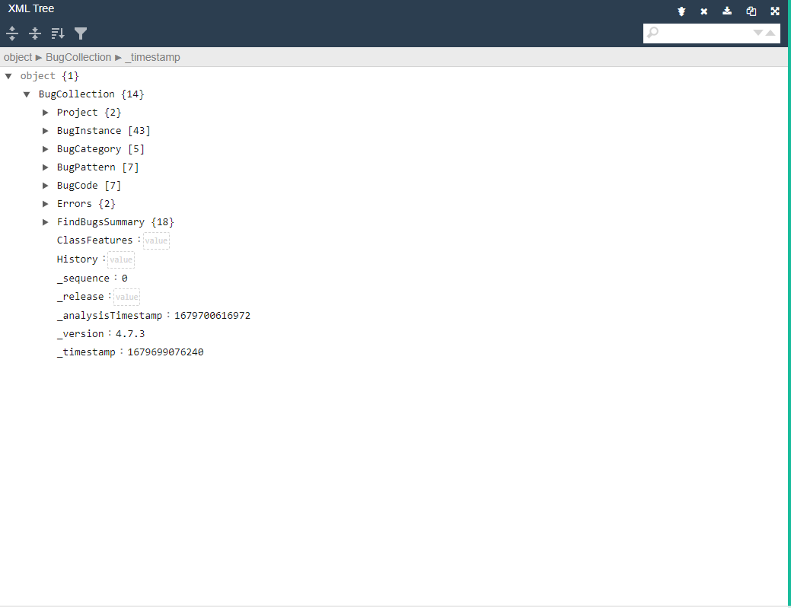

# Sprint 3 Static Analysis Report
## PMD Report Before

## PMD Report After

## PMD Discussion
The first PMD report showed several issues with our Company and Project classes that were related to unnecessary includes and useless parenetheses in some of our methods. We decided to address these issues by refactoring our Company and Project classes to remove the unnecessary includes and useless parenetheses. This is shown by the PMD after image that shows the issues we chose were addressed and fixed.

## SpotBugs Report Before

## SpotBugs Report After

## SpotBugs Discussion
We ran into several issues with getting Spotbugs to produce useable output for us to use during this sprint. Initially SpotBugs was only generating an XML file that was not conducive to finding bugs within our code. To address this issue we ran the XML output files through an XML file converter. The XML converter also showed that there were several formatting errors in the XML that SpotBugs generated by default. Upon fixing the XML formatting issues we were able to run the now modified XML to create a tree view that gave more info into the potential bugs within our code. The changes we made based on the PMD results however did not imporve the bugs count that SpotBugs generated. Due to time constraints we were not able to tackle the bugs presented by SpotBugs. This is because we spent the majority of the sprint fixing issues that were discovered during the running of our P2 code against the TA's implmentation. 
